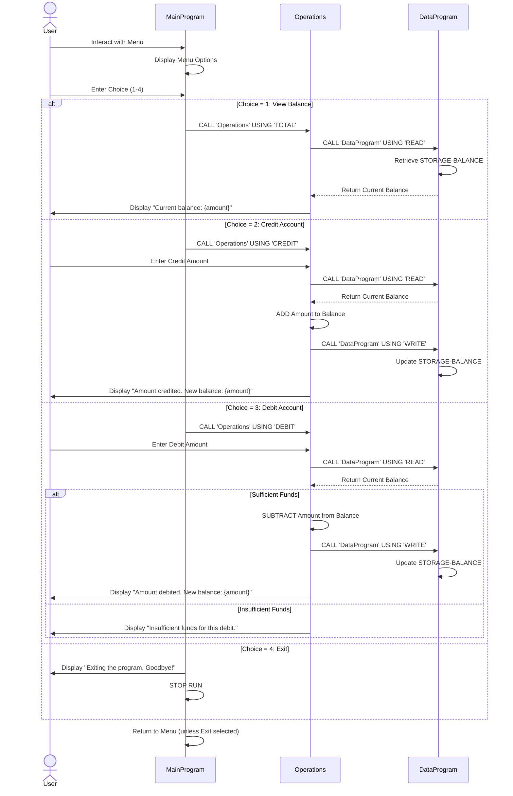

# COBOL Legacy Code Documentation

## Overview
This directory contains documentation for the COBOL legacy codebase related to student account management.

## COBOL Files

### File Structure
| File Name | Purpose | Key Functions | Business Rules |
|-----------|---------|----------------|-----------------|
| {filename_1} | {description} | {functions} | {rules} |
| {filename_2} | {description} | {functions} | {rules} |

## Student Account Business Rules
- {rule_1}
- {rule_2}
- {rule_3}

## Getting Started
Refer to individual COBOL file documentation for detailed implementation specifics.

## Data Flow Sequence Diagram

